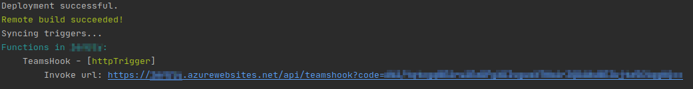
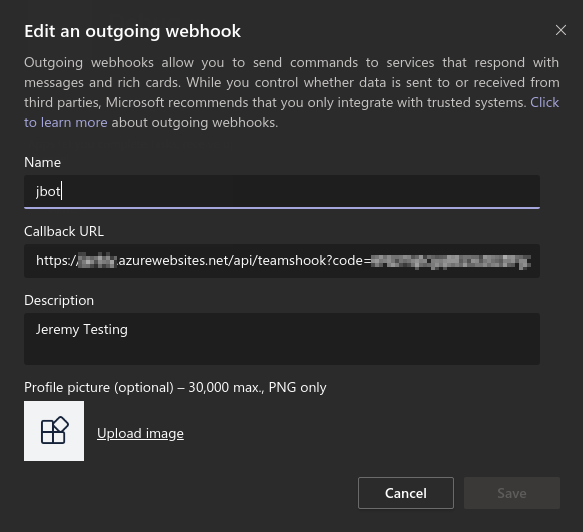
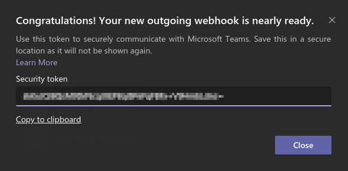
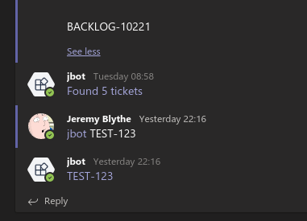

### Teams bot Jira issue URL builder

I get emails and chat messages like this a lot:
```
Hey, can you give me an update on these issues please?
- BACKLOG-10167
- BACKLOG-10214
- BACKLOG-9917
- BACKLOG-10198
- BACKLOG-9886
```
Or worse, spreadsheets with issue keys and not links.

To avoid the tedium of copying and pasting each key into the Jira search I made a
simple bit of Python to find key-like entries in a string using a regex. It then produces
a URL to browse one issue or a search query if multiple were found (as above). Nothing
groundbreaking but quite useful. The fun bit is turning this into a Microsoft Teams "bot"
that you give the input text and it produces a link for you to click on.

While there is a full bot framework for Teams I just needed something simple so this is implemented
with an Outgoing Webhook and an Azure Function.

### Prerequisites

Use the **jbot** code and follow this guide [Quickstart: Create a function in Azure that responds to HTTP requests](https://docs.microsoft.com/en-us/azure/azure-functions/functions-create-first-azure-function-azure-cli?tabs=bash%2Cbrowser&pivots=programming-language-python) to 
get your local and Azure environments set up.

### Setup Teams for an Outgoing WebHook

Using the Azure Functions Core Tools, run the following command. Replace <APP_NAME> with the name of your Linux Function App.

```bash
func azure functionapp publish <APP_NAME>
```

The console output should contain the URL of the TeamsHook function:



This URL is needed in the Teams outgoing webhook configuration.
Go to "Manage Team">>Apps>>"Create an outgoing webhook" and fill in the form using the URL from above.



When you select "Save" Teams will give you a security token:



Copy this to the clipboard. Then in the Azure portal go to the "Configuration" for the App Service
and enter two new "Application settings": `jira_host` and `security_token`. For the latter paste the 
Teams security token.

### Run it!

@mention the bot in a channel in the team and then provide some text that contains one or more Jira issue keys.
The bot will respond with a link to a single issue or a query where more than one issue is found.

